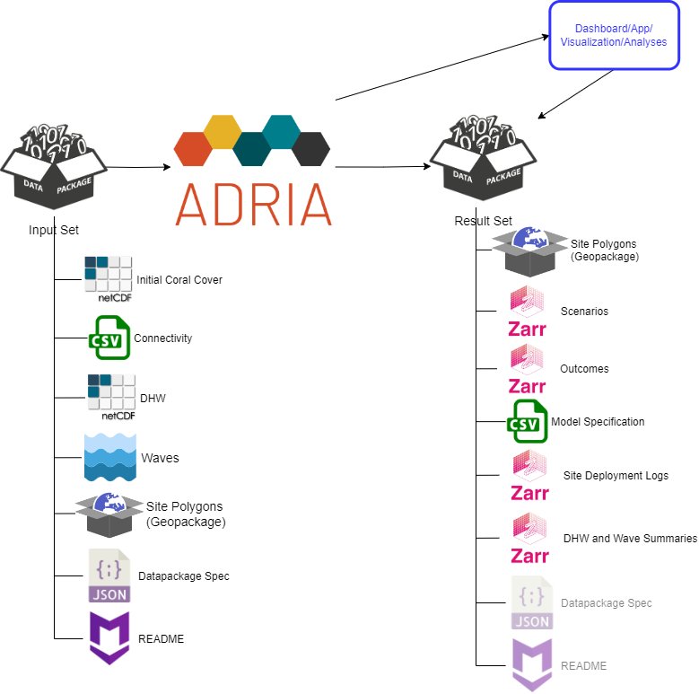

# Inputs and Outputs

## Domain data package

Prior to running the ADRIA coral ecosystem model, the first step (after importing the package) is to load domain data.

```julia
dom = ADRIA.load_domain("path to some domain")
```

As the naming suggests, inputs are taken to represent a given spatial area, and so are referred to as a `Domain`.

ADRIA seeks to use [Data Packages](https://specs.frictionlessdata.io/#what%E2%80%99s-a-data-package) to define
a standard structure, format, and naming convention for its inputs and outputs.

By definition, a Data Package is a directory holding the required data for ADRIA to run.

The `Domain` data package consists of:

- Connectivity (CSVs, grouped by year)
- Degree-Heating Week trajectories (in netCDF format; dimensions: timestep ⋅ location ⋅ projection)
- Wave stress (as netCDFs; dimensions: timestep ⋅ location ⋅ projection)
- Geospatial data
- a `datapackage.json` file with machine-readable metadata
- a `README.md` file with human-readable content

Geospatial data consists of:
- polygons defining individual reefs/sites in [geopackage format](https://www.geopackage.org/)
- initial coral cover (as a netCDF; with dimensions: species/sizes ⋅ locations)

### Naming conventions

By convention, the directory name is typically the name of the reef or reef cluster.
Where multiple datasets for the same spatial domain are expected, appending a unique suffix is 
recommended, such as the date of creation, such as "Moore\_2022-11-17".

The geopackage is expected to have the same filename as its Domain. For example, if
the domain name is "Example_domain", then the geopackage file should be named
"Example\_domain.gpkg".

Degree-heating Week datasets must follow the convention of: `dhwRCP[NN].nc`

Here, `[NN]` is to be replaced with the two digit RCP code that indicates which RCP scenario
is represented by the given data cube. The following are examples of valid/expected filenames:

- `dhwRCP26.nc`
- `dhwRCP34.nc`
- `dhwRCP45.nc`
- `dhwRCP60.nc`
- `dhwRCP70.nc`
- `dhwRCP85.nc`

Similarly, below are examples of valid/expected wave stress filenames:

- `wave_RCP26.nc`
- `wave_RCP34.nc`
- `wave_RCP45.nc`
- `wave_RCP60.nc`
- `wave_RCP70.nc`
- `wave_RCP85.nc`

Below is a diagram indicating the directory layout

```
Example_domain
│   datapackage.json
│   README.md
│
├───connectivity
│   ├───2015
│   │       connect_matrix_2015_1.csv
│   │       connect_matrix_2015_2.csv
│   │       connect_matrix_2015_3.csv
│   │
│   ├───2016
│   │       connect_matrix_2016_1.csv
│   │       connect_matrix_2016_2.csv
│   │       connect_matrix_2016_3.csv
│   │
│   └───2017
│           connect_matrix_2017_1.csv
│           connect_matrix_2017_2.csv
│           connect_matrix_2017_3.csv
│
├───DHWs
│       dhwRCP26.nc
│       dhwRCP45.nc
│       dhwRCP60.nc
│       dhwRCP85.nc
│
├───site_data
│       coral_cover.nc
│       Example_domain.gpkg
│
└───waves
        wave_RCP26.nc
        wave_RCP45.nc
        wave_RCP60.nc
        wave_RCP85.nc
```

## ResultSets

The directory holding results is also treated as a data package referred to as a `ResultSet`. 
Scenario outcomes are written out to disk as they complete to a directory located in the 
user-defined `Output` directory (see [Getting started](@ref Getting started)).

The directory name follows the convention of `[Domain Name]__[IDs of RCPs]__[date/time of run]`.
For example: `Moore_2022-11-17__RCPs45_60__2023-01-01_19_00_00_000`

The above example `ResultSet` indicates the "Moore_2022-11-17" Domain was run for RCPs 4.5 and 6.0
at precisely 7pm (i.e., 19:00:00.000, where the trailing "000" indicates milliseconds). Note that
each "portion" of information is separated by a double underscore (`__`).

Simulation results are stored in [Zarr format](https://zarr.readthedocs.io/en/stable/spec/v2.html).
A `ResultSet` also holds a copy of:

- the scenario specifications run
- the geospatial data used
- model specification for the simulations run
- Summary statistics for the DHW/wave scenarios run, and
- Logs indicating which locations were intervened on

Below is a diagram of the directory structure. Filenames are not shown here as there may
be hundreds/thousands depending on the scenario set run.

```
Example_domain__RCP45_60_85__2023-03-11_19_00_00_000
├───env_stats
│   ├───dhw
│   │   ├───45
│   │   ├───60
│   │   └───85
│   └───wave
│       ├───45
│       ├───60
│       └───85
├───inputs
├───logs
│   ├───fog
│   ├───rankings
│   ├───seed
│   └───shade
├───model_spec
├───results
│   ├───absolute_shelter_volume
│   ├───relative_juveniles
│   ├───relative_shelter_volume
│   ├───relative_taxa_cover
│   └───total_absolute_cover
└───site_data
```


